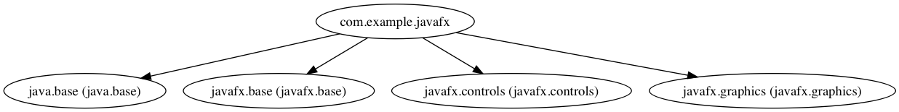

= javafx

The JavaFX project has been taken from the lesson 4 of the https://www.oracle.com/goto/JavaGame2[Java Puzzle Ball MOOC] in order to transform it to an application module. Don't feel that you need to first understand the codebase to make the project modular. This example is all about how likely to fix some problems you might face when migrating an javafx project. The graph below is generated by the following jdeps command:

----
$ jdeps --module-path out -dotoutput dot/ -recursive -m com.example.javafx
----

It looks like we have 4 dependencies from the platform module. However if you look at the module description (i.e. `module-info.java`) of the project, you only see one dependency instead of three (we don't count the `java.base` module since it is an implicit dependency). Try to compile the application with an empty module descriptor and examine what the errors tell us.

----
$ javac -d out --source-path src/ $(find src/ -name '*.java')
 (package javafx.scene.control is declared in module javafx.controls, but module com.example.javafx does not read it)
src/com/example/javafx/NewFXMain.java:7: error: package javafx.application is not visible
import javafx.application.Application;
...
...
 (package javafx.application is declared in module javafx.graphics, but module com.example.javafx does not read it)
src/com/example/javafx/NewFXMain.java:8: error: package javafx.scene is not visible
import javafx.scene.Group;
...
...
----

The module could't read the types from the `javafx.controls` and `javafx.graphics` modules at compile time. We need to require the modules mentioned in the output whereas how  the compilation is fixed by adding just one module must be known. Let's take a deep look at the mentioned modules's descriptors. The snippet below shows all we need about why the module only requires the `javafx.controls` module itself. If we add a dependency from the `javafx.controls` module, all two modules namely `javafx.graphics` and `javafx.base` are *transitively* resolved! thanks to the `transitive` keyword on the `requires` clause. Our application is able to read directly all the exported implementations of the three modules. In a way that we kill three birds with one stone!

----
module javafx.base {
    ...
}

module javafx.graphics {
    requires transitive javafx.base;
    ...
}

module javafx.controls {
    requires transitive javafx.base;
    requires transitive javafx.graphics;
    ...
}
----

Adding the `requires javafx.controls` module, this time we run the same command and the result is shown with success. In this case, ignore the note appearing on the output. It's because collections are used without type specifiers in the `ButtonController` class.

----
$ javac -d out  --source-path src/ $(find src/ -name '*.java')
Note: src/com/example/javafx/ButtonController.java uses unchecked or unsafe operations.
Note: Recompile with -Xlint:unchecked for details.
----

The module is now in the ready state:

----
$ java -p out/ -m com.example.javafx/com.example.javafx.NewFXMain
Caused by: java.lang.IllegalAccessException: class com.sun.javafx.application.LauncherImpl (in module javafx.graphics) cannot access class com.example.javafx.NewFXMain (in module com.example.javafx) because module com.example.javafx does not export com.example.javafx to module javafx.graphics
----

Ups... it seems like It doesn't!. Why it didn't run is obvious that the module `javafx.graphics` could't access the `com.example.javafx.NewFXMain` class to launch the application.  The `NewFXMain` class extends to the `Application` class. What's more, if we follow the workflow, we realise that the `Application` class uses `LauncherImpl.launchApplication(appClass, args);` to launch the application. It must access the class itself at runtime. Since the class itself (i.e. `NewFXMain`) isn't allowed to outside, the application fails. So be aware that compiling a project with success doesn't mean that the project will up and run at runtime.

There are two steps I know to handle this issue. Either export the package to all other modules or export the package only to one particular module.

.exports to the world
----
module com.example.javafx {
    
    ...

    exports com.example.javafx;
}
----

.exports only to the `javafx.graphics` module
----
module com.example.javafx {

    ...

    exports com.example.javafx to javafx.graphics;
}
----

The second one is more reliable because we explicitly say that only the module `javafx.graphics` will read the types from the `com.example.javafx` package at runtime.