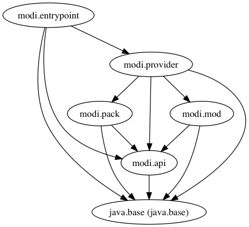
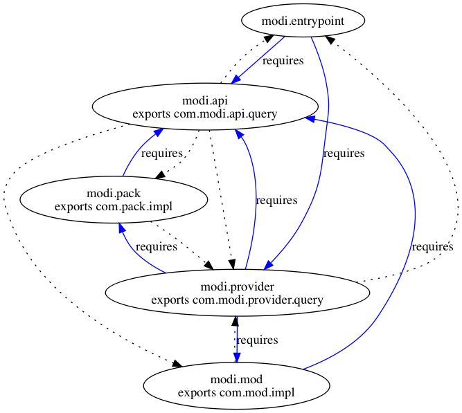

= ModiM(odule)s
:experimental:
:toc: macro
:toc-title: Contents

This is a project that shows how to compile and run multiple named modules (i.e. application modules). We refactor the codebase of the `modim` module and then transform it into maintainable multiple named modules. This system works as expected using the `exports` and `requires` clauses. We are able to search modules and packages by name from the `modi.entrypoint` module by means of the `modi.provider` module. In fact, the entrypoint module itself doesn't know the underlying implementations of the `modi.api` module. It only knows the `modi.provider` and the `modi.api`. The `modi.pack` and `modi.mod` implements the module and package search respectively. The 2 implementations of the `modi.api` are hidden from the `modi.entrypoint` module. Another way of doing the same approach is to use Service Loader. The `modims-provides-uses` project illustrates how to do that using Service Loader.

You can examine the dot files of the modules by looking at the `dot` directory or try the following command out after cloning and compiling the modules yourselves:

----
$ jdeps -recursive --module-path out -dotoutput dot -m modi.entrypoint
----

.the complete relation of the system.

The graph below describes the `exposes` - `requires` relation between modules. Every time a module must *export its package(s)* when another module wants to use the module's API. Likewise another module must *require the module* to access their API. In our case, the provider module needs to access the implementations (i.e. `modi.mod` and `modi.pack` modules) of the `modi.api` module. Thus, it requires the 2 implementation modules and the api module itself. The required modules must exports their necessary types to be reached by the other modules. For example, the `com.pack.impl` package is exported by the `modi.pack` module since the package contains the implementation type.

.the final project tree view.
----
├── README.adoc
├── dot
├── modi.api
│   ├── modi.api.iml
│   └── src
│       ├── com
│       │   └── modi
│       │       └── api
│       │           └── query
│       │               └── Query.java
│       └── module-info.java
├── modi.entrypoint
│   ├── modi.entrypoint.iml
│   └── src
│       ├── com
│       │   └── modi
│       │       └── entrypoint
│       │           └── Main.java
│       └── module-info.java
├── modi.mod.impl
│   ├── modi.mod.impl.iml
│   └── src
│       ├── com
│       │   └── mod
│       │       └── impl
│       │           └── ModuleQuery.java
│       └── module-info.java
├── modi.pack.impl
│   ├── modi.pack.impl.iml
│   └── src
│       ├── com
│       │   └── pack
│       │       └── impl
│       │           └── PackageQuery.java
│       └── module-info.java
├── modi.provider
│   ├── modi.provider.iml
│   └── src
│       ├── com
│       │   └── modi
│       │       └── provider
│       │           ├── query
│       │           │   └── QueryProvider.java
│       │           └── util
│       │               └── Flags.java
│       └── module-info.java
└── out
----

toc::[]

=== #{counter:index} Compiling the project

We compile the 5 related modules separately and place their compiled classes into the `out/` directory.

----
$ javac -d out/modi.api/ --source-path modi.api/src/  $(find modi.api/src -name '*.java') <1>
$ javac -d out/modi.mod/ --module-path out/  --source-path modi.mod.impl/src/  $(find modi.mod.impl/src/ -name '*.java')
$ javac -d out/modi.pack/ --module-path out/  --source-path modi.pack.impl/src/  $(find modi.pack.impl/src/ -name '*.java')
$ javac -d out/modi.provider/ --module-path out/  --source-path modi.provider/src/  $(find modi.provider/src/ -name '*.java')
$ javac -d out/modi.entrypoint/ --module-path out/  --source-path modi.entrypoint/src/  $(find modi.entrypoint/src/ -name '*.java')
----
1. The `modi.api` module is compiled first since it is used by other 4 modules. This module should be on their module path. So last 4 `javac` commands must use the `--module-path` flag. `--source-path` is the another form of `-sourcepath`.

=== #{counter:index} Running the project

We are in the running stage of the project. The project itself consists of 5 modules each of which has a module description. In a way, the module path is all we need to run the complete system. The `out` directory consists of 5 modules. we directly give that directory in the `java` command and specify the `modi.entrypoint` module where it has a `static` `main` method to execute the project itself.

----
$ java -p out/ -m modi.entrypoint/com.modi.entrypoint.Main
Commands:
-m,--module   a module name
-p,--package  a package name
$ java -p out/ -m modi.entrypoint/com.modi.entrypoint.Main -p java.lang
:)
$ java -p out/ -m modi.entrypoint/com.modi.entrypoint.Main -m java.base
:)
----

=== #{counter:index} JAR festival

Since each module is an independent named application module, you must create 5 different modular jar files. The created modular JARs have a module version which is 1.1.0. The `modi.entrypoint` module solely has a main class.

----
$ mkdir jar
$ jar -c -f jar/modi.api@1.1.0.jar --module-version 1.1.0 -C  out/modi.api/ .
$ jar -c -f jar/modi.mod@1.1.0.jar --module-version 1.1.0 -C  out/modi.mod/ .
$ jar -c -f jar/modi.pack@1.1.0.jar --module-version 1.1.0 -C  out/modi.pack/ .
$ jar -c -f jar/modi.provider@1.1.0.jar --module-version 1.1.0 -C  out/modi.provider/ .
$ jar -c -f jar/modi.entrypoint@1.1.0.jar --module-version 1.1.0 -e com.modi.entrypoint.Main -C  out/modi.entrypoint/ .
----

Let's inspect the module description of the `modi.entrypoint` JAR file. We can infer the following meanings from the result of the module description; the module itself needs to react the `modi.api` and the `modi.provider` modules. The description clarifies these necessary requirements using the `requires` clause. Next to this, the module contains one package which is `com.modi.entrypoint` and it has a main class called `Main` in the `com.modi.entrypoint` package.

----
$ jar -d -f jar/modi.entrypoint@1.1.0.jar
modi.entrypoint@1.1.0 jar:file:///Users/hakan/projects/jigsaw/modims/jar/modi.entrypoint@1.1.0.jar/!module-info.class
requires java.base mandated
requires modi.api
requires modi.provider
contains com.modi.entrypoint
main-class com.modi.entrypoint.Main
----

The `jar` directory now stores the application modules:

----
.
└── jar
   ├── modi.api@1.1.0.jar
   ├── modi.entrypoint@1.1.0.jar
   ├── modi.mod@1.1.0.jar
   ├── modi.pack@1.1.0.jar
   └── modi.provider@1.1.0.jar
----

Last, we run the application by putting the JAR files on the module path. Since the `modi.entrypoint` module has an module description, we don’t need to add the qualified module name and its class name with the `-m` flag. The Java 9 command will look at the module description and take the main class.

----
$ java -p jar/ -m modi.entrypoint -m java.base
:)
$ java -p jar/ -m modi.entrypoint -m java.xml.bind
:( <1>
----
1. The `java.xml.bind` module even it’s part of the Java module system, we only depend on the `java.base` module. As a result, searching an unrelated module does give :(.

=== #{counter:index} Dockerize the application module

This time, we make our own Docker image containing the essentials modules as we did in the modim project with ease. But first, we need to make sure that you have a docker image serving JDK 9 on top of Alpine 3.6 like the `alpine:jdk-9-musl` image we use in our projects. Also see the modim project in this repository, if you want to get more particular information about creating a bare minimum Java runtime image for the Alpine Linux distribution.

----
$ docker run -v $(pwd):/modi/ -w /modi --rm alpine:jdk-9-musl jlink \
  --launcher modims=modi.entrypoint/com.modi.entrypoint.Main \
  --output modimage/ \
  --verbose \
  --no-header-files --no-man-pages --compress 2 \
  --module-path jar:/opt/jdk-9/jmods \
  --add-modules modi.entrypoint <1>
java.base file:///opt/jdk-9/jmods/java.base.jmod
modi.api file:///modi/jar/modi.api@1.1.0.jar
modi.entrypoint file:///modi/jar/modi.entrypoint@1.1.0.jar
modi.mod file:///modi/jar/modi.mod@1.1.0.jar
modi.pack file:///modi/jar/modi.pack@1.1.0.jar
modi.provider file:///modi/jar/modi.provider@1.1.0.jar

Providers:
 java.base provides java.nio.file.spi.FileSystemProvider used by java.base
----
1. `modi.entrypoint` is the root module,  Jlink starts proceeding the runtime image.

Now that we have an runtime image, we are able to make a Docker image based on Alpine 3.6.

----
$ docker build -t modims --no-cache .
$ docker images
  REPOSITORY                TAG                 IMAGE ID            CREATED             SIZE
  modims                  latest              289ab9865287        3 seconds ago       37.4MB

$ docker run --rm modims:latest -m modi.mod
:)
$ docker run --rm modims:latest -p com.modi.provider.util
:)
$ docker run --rm --entrypoint java modims:latest --list-modules <1>
java.base@9-ea
modi.api@1.1.0
modi.entrypoint@1.1.0
modi.mod@1.1.0
modi.pack@1.1.0
modi.provider@1.1.0
----
1. Only 5 modules come bundled with the application itself.