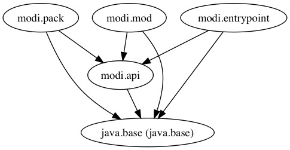
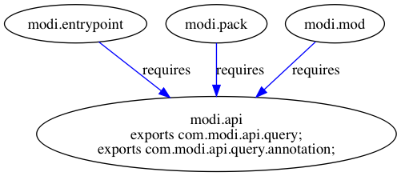
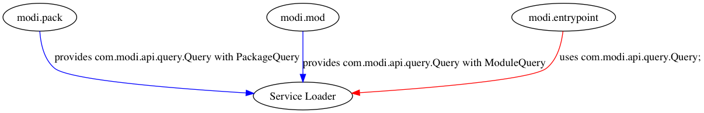

= ModiM(odule)s
:experimental:
:toc: macro
:toc-title: Contents

The project consists of 4 application modules expect a provider module. In fact, it serves the same state of the `modism-exports-requires` project. But now, our aim is to run the same system by means of the `provides ... with` and  `uses` clauses. The dot files are located in the `dot` directory. The following `jdeps` commands generates the mentioned dot files of the module system.  

----
$ jdeps --module-path out -dotoutput dot/ -recursive -m modi.entrypoint
$ jdeps --module-path out -dotoutput dot/mod/ -recursive -m modi.mod
$ jdeps --module-path out -dotoutput dot/pack/ -recursive -m modi.pack
$ jdeps --module-path out -dotoutput dot/api/ -recursive -m modi.api
----

However, none of the above commands generates the entire module diagram in one picture because `modi.mod`, `modi.pack`, and `modi.entrypoint` don't belong to each other. Keep in mind that these modules implicitly depends on the `java.base` platform module. We draw our own graphs to illustrate the module relation as below.

But wait... how is it possible that the `modi.entrypoint` module works without touching `modi.pack` and `modi.mod`? In other words, how the application works without knowing `modi.pack` and `modi.mod`? The answer is *Service Provider*. Java Service Provider is around us since Java 1.6. We are able to use it in Java 9 as well to access loosely coupled service implementations/providers from other modules.

In order to register the implementations of a service (or providers of a service), we need to use the `provides .. with` clause in the module description of each implementation module. In our case, we have a search service. The search interface was declared in the `modi.api` module. As you probably know that the application simply provides a way of searching a module name or a package name among the available modules and packages. Since we have 2 different options, we have 2 different search implementations/providers. ModuleQuery is in charge of finding whether a given module name exists or not. On the other hand, PackageQuery enables to search the presence of a given package name. These services could be anything like a CRUD service. As a result, the `modi.pack` module provides the Query interface with its implementation `PackageQuery` and the `modi.mod` module provides the Query interface with its implementation `ModuleQuery`. When we apply for Service Loader, it will find the registered Query providers (e.g. `ModuleQuery` and `PackageQuery`) at runtime. To find these implementations from another module we need to use the `uses` clause; we would access related service implementations as *providers*. The `modi.entrpoint` module applies for the `uses` clause to consume the concrete Query services. Plus, the entrypoint module itself doesn’t know the underlying implementations of the Query service.

toc::[]

=== #{counter:index} Compiling the project

We compile the 4 related modules separately and place their compiled classes into the out/ directory.

----
$ javac -d out/modi.api/ --source-path modi.api/src/  $(find modi.api/src -name '*.java')
$ javac -d out/modi.mod --module-path out/modi.api/ --source-path modi.mod.impl/src/  $(find modi.mod.impl/src/ -name '*.java') <1>
$ javac -d out/modi.pack --module-path out/modi.api/ --source-path modi.pack.impl/src/  $(find modi.pack.impl/src/ -name '*.java') <2>
$ javac -d out/modi.entrypoint/ --module-path out/modi.api --source-path modi.entrypoint/src/  $(find modi.entrypoint/src/ -name '*.java') <3>
----
1. The `modi.api` module is added on the module path from the `out/` directory.
2. Only the `modi.api` module is needed to be on the module path.
3. Only the `modi.api` module is needed to be on the module path.

=== #{counter:index} Running the project

We are in the running stage of the project. The project itself consists of 4 modules each of which has a module description. In a way, the module path is all we need to run the complete system. The `out` directory now consists of 4 named exploded modules. We directly give that directory in the java command and specify the `modi.entrypoint` module where it has a static main method to execute the project itself.

----
$ java -p out/ -m modi.entrypoint/com.modi.entrypoint.Main -module
Commands:
-m,--module     a module name
-p,--package    a package name
$ java -p out/ -m modi.entrypoint/com.modi.entrypoint.Main --module java.base
:)
----

=== #{counter:index} JAR festival

Since each module is an independent named application module, you must create 4 different modular JAR files. These JARs will have their own module version.

----
$ mkdir jar
$ jar -c -f jar/modi.api@1.2.0.jar --module-version 1.2.0 -C  out/modi.api/ .
$ jar -c -f jar/modi.mod@1.2.0.jar --module-version 1.2.0 -C  out/modi.mod/ .
$ jar -c -f jar/modi.pack@1.2.0.jar --module-version 1.2.0 -C  out/modi.pack/ .
$ jar -c -f jar/modi.entrypoint@1.2.0.jar --module-version 1.2.0 -e com.modi.entrypoint.Main -C  out/modi.entrypoint/ .
----

After the above steps, the `jar` directory provides the following application modules:

----
.
└── jar
   ├── modi.api@1.2.0.jar
   ├── modi.entrypoint@1.2.0.jar
   ├── modi.mod@1.2.0.jar
   └── modi.pack@1.2.0.jar
----

Last, we run the application by putting the JAR files on the module path. Since the `modi.entrypoint` module has an module description, we don’t need to add the qualified module name and its class name with the `-m` flag. The Java 9 command will look at the module description and take the main class.

----
$ java -p jar/ -m modi.entrypoint -m java.base
:)
$ java -p jar/ -m modi.entrypoint -m java.xml.bind
:(  <1>
----
1. The `java.xml.bind` module even it’s part of the Java module system, we only depend on the `java.base` module. As a result, searching an unrelated module does give :(.

=== #{counter:index} Dockerize the application module

We are ready to create an own Docker image but first we need an application runtime image.

----
$ docker run -v $(pwd):/modi/ -w /modi --rm alpine:jdk-9-musl jlink \
  --launcher modims=modi.entrypoint/com.modi.entrypoint.Main \
  --output modimage/ \
  --verbose \
  --no-header-files --no-man-pages --compress 2 \
  --module-path jar:/opt/jdk-9/jmods \
  --add-modules modi.entrypoint,modi.mod,modi.pack <1>
java.base file:///opt/jdk-9/jmods/java.base.jmod
modi.api file:///modi/jar/modi.api@1.2.0.jar
modi.entrypoint file:///modi/jar/modi.entrypoint@1.2.0.jar
modi.mod file:///modi/jar/modi.mod@1.2.0.jar
modi.pack file:///modi/jar/modi.pack@1.2.0.jar

Providers: <2>
  modi.mod provides com.modi.api.query.Query used by modi.entrypoint
  modi.pack provides com.modi.api.query.Query used by modi.entrypoint
  java.base provides java.nio.file.spi.FileSystemProvider used by java.base
----
1. Each mentioned application module is an individual root module.
2. Note that the runtime image provides 3 different providers now!

Now that we have an runtime image, we are able to make a Docker image based on Alpine 3.6.

----
$ docker build -t modims --no-cache .
Sending build context to Docker daemon  33.68MB
Step 1/5 : FROM alpine:3.6
 ---> 053cde6e8953
Step 2/5 : COPY modimage /opt/modi
 ---> cc2719e40f00
Step 3/5 : ENV JAVA_HOME=/opt/modi
 ---> Running in 8d0a4cb2ba7f
Removing intermediate container 8d0a4cb2ba7f
 ---> f3de07641028
Step 4/5 : ENV PATH=$PATH:$JAVA_HOME/bin
 ---> Running in 38f2874e42ff
Removing intermediate container 38f2874e42ff
 ---> 3b04f3233e47
Step 5/5 : ENTRYPOINT [ "modims" ]
 ---> Running in e77434c19450
Removing intermediate container e77434c19450
 ---> 0e128cebe4ba
Successfully built 0e128cebe4ba
Successfully tagged modims:latest

$ docker run --rm modims:latest -m modi.mod
:)
----