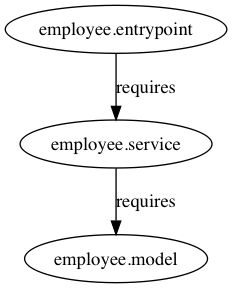
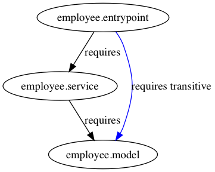

= Ret (Requires Transitive)

In this example, we'll learn how to handle transitive dependencies on a module system. The current system rely on three independent modules. The `employee.model` module has a model class called `Employee`. The `employee.service` module depends upon the `Employee` class and works as a service layer. The service module provides a service `EmployeeService` along with its implementation `EmployeeServiceImpl`. The last module simply consumes the employee service by querying employees based on a few criteria. The relation between modules are illustrated below:

Now we use one of the service methods by applying for Service Loader in the module `entrypoint`. If we run the code below, we don't see the excepted result rather we see the following exception:

----
EmployeeService employeeService = ServiceLoader.load(EmployeeService.class).findFirst().get();

employeeService.findOneBy(44).ifPresent(System.out::println);

Error:(3, 41) java: employee.model.Employee is not visible
  (package employee.model is declared in module employee.model, but module employee.entrypoint does not read it)
----

It says that the `entrypoint` module cannot react the model `employee.model.Employee` at runtime because it's not visible to the entrypoint module. The `employeeService.findOneBy(44)` method returns the first selected employee from the list where the employee's age is 44. So it looks like the employee service finds one employee and reveals to the client. Therefore, we need to access to the `employee.model.Employee` class from the entrypoint module. Now we understand what the problem is. There are two options to fix that issue. First, we can add another `requires` clause to the module description of entrypoint which is not quite reliable since we have to handle it manually. Second is that, we can let the `employee.entrypoint` module deal with the transitive dependency automatically when adding the  direct dependency (i.e. the `employee.service` module). In our case, the transitive dependency is the `employee.model.Employee` class exported from the `employee.model` module. Plus, this dependency is the dependency of the `employee.service` module. Editing the module description of the service module by just adding the `transitive` keyword in the `requires` clause will fix the problem.

.the complete module description of the service module
----
module employee.service {

    ...

    requires transitive employee.model;

    ...
}
----

Now the `Employee` class is visible and readable from other modules as long as the `employee.service` module is required.

[NOTE]
====
The compilation process is resolved by `maven` >= 3.0.0.

----
$ cd requires-transitive/
$ mvn clean install
----
====

=== Dockerize the application module

To create our own Docker image, we need an application runtime image first for Alpine Linux. https://maven.apache.org/plugins/maven-jlink-plugin/[Maven Jlink Plugin] is in the pre-release stage for Java 9, I couldn't create one with the plugin (If you manage to work with it, please let me know). So we perform the same steps as we already did before, just copy all the modular application JARs into the `jar` directory and generate an runtime image.

----
$ pwd
/jigsaw/requires-transitive
$ mkdir jar
$ cp employee.entrypoint/target/employee.entrypoint-1.0.jar jar
$ cp employee.service/target/employee.service-1.0.jar jar
$ cp employee.model/target/employee.model-1.0.jar jar
$
$ docker run -v $(pwd):/modi/ -w /modi --rm alpine:jdk-9-musl jlink \
  --launcher transitive=employee.entrypoint/employee.entrypoint.Main \
  --output image/ \
  --verbose \
  --no-header-files --no-man-pages --compress 2 \
  --module-path jar:/opt/jdk-9/jmods \
  --add-modules employee.entrypoint
employee.entrypoint file:///modi/jar/employee.entrypoint-1.0.jar
employee.model file:///modi/jar/employee.model-1.0.jar
employee.service file:///modi/jar/employee.service-1.0.jar
java.base file:///opt/jdk-9/jmods/java.base.jmod

Providers: <1>
  employee.service provides employee.service.api.EmployeeService used by employee.entrypoint
  java.base provides java.nio.file.spi.FileSystemProvider used by java.base
----
1. Note that the runtime image provides 2 providers.

Now that we have an runtime image, we can put it on a container and launch:

----
$ docker build -t transitive --no-cache .
Sending build context to Docker daemon  33.61MB
Step 1/5 : FROM alpine:3.6
 ---> 053cde6e8953
Step 2/5 : COPY image /opt/modi
 ---> 65e025493e8a
Step 3/5 : ENV JAVA_HOME=/opt/modi
 ---> Running in 7d4d380df3db
Removing intermediate container 7d4d380df3db
 ---> 833f964c2860
Step 4/5 : ENV PATH=$PATH:$JAVA_HOME/bin
 ---> Running in 4af4974e9283
Removing intermediate container 4af4974e9283
 ---> 150a7a9f1072
Step 5/5 : ENTRYPOINT [ "transitive" ]
 ---> Running in b2e73e9feff9
Removing intermediate container b2e73e9feff9
 ---> eef3c9e6a6f4
Successfully built eef3c9e6a6f4
Successfully tagged transitive:latest
$
$ # run the mudular runtime image called transitive
$
$ docker run --rm transitive:latest
{"age":44, "name":'Marc', "surname":'Denim', "address":'Izmir'}
{"age":31, "name":'Sophie', "surname":'Fun', "address":'Adana'}
{"age":25, "name":'Paul', "surname":'Doe', "address":'Izmir'}
{"age":51, "name":'Paul', "surname":'Richard', "address":'Ankara'}
----
